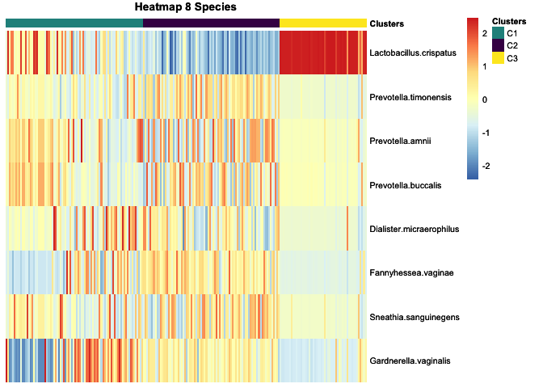

<!-- README.md is generated from README.Rmd. Please edit that file -->

# BVML

<!-- badges: start -->

<!-- badges: end -->

BVML is a patient stratification package for Bacteral Vaginosis disease.
This package through a pre-trained Random Forest model and metagenomic
profile of 8 bacterial species is able to classify patients into three
classes:

  - Class C1: patients with incipient dysbiosis.
  - Class C2: patients with a BV+ profile.
  - Class C3: patients with a BV- profile.

## Installation

To install the BVML, install from github using devtools:

``` r
install.packages("devtools")
library(devtools)
devtools::install_github("DiegoFE94/BVML")
```

## Main fuction

  - BVClassify: This function has as input a dataframe whose columns
    correspond to the selected species (in the correct format) and rows
    correspond to the samples. You can choose the type of input format
    of the species you are using by using the type (string) parameter.
    If you are using species names you should specify “species”, however
    if you are using NCBI IDs you should specify “NCBI”. It also has as
    input a logical value TRUE/FALSE. This function performs the
    classification of the samples into the three corresponding classes
    of the algorithm. The output is a dataframe where the columns
    correspond to the samples, the columns correspond to the probability
    of belonging to each class and to which class it corresponds
    according to the algorithm. In addition, if TRUE is selected in the
    input, it returns a Heatmap with the metagenomic profile of the
    dataframe.

## Internal Functionalities

This section explains the different functionalities that constitute the
main fuction.

  - convert\_ncbi\_ID: This function has as input a dataframe in which
    the columns correspond to the NCBI IDs of the 8 species and the rows
    to the samples. The function converts the NCBI IDs to the species
    names in the correct format for prediction.

  - check\_sps: This function has as input a dataframe whose columns
    correspond to the selected species and rows correspond to the
    samples. This function checks that all the required species are
    present in the dataframe and that they are in the correct format.
    Also try to put the species names in the required format.

  - normdataset: This function has as input a dataframe whose columns
    correspond to the selected species and rows correspond to the
    samples. This function performs the log2 normalization of the
    species, a preprocessing necessary to perform the prediction.

## Example

This is a basic example which shows you how to use the package:

``` r
library(BVML)
# First charge a demo dataset
data(sample_data)
# Final step: make class prediction using species names and plotting the Heatmap
results <- BVClassify(sample_data, type = "species", plot_HM = TRUE)
print(results)
```

    #> $results
    #>       prob.C1 prob.C2 prob.C3 response
    #> X1130   0.964   0.027   0.009       C1
    #> X1239   0.000   0.000   1.000       C3
    #> X1126   0.270   0.707   0.023       C2
    #> X1137   0.992   0.000   0.008       C1
    #> X1128   0.012   0.001   0.987       C3
    #> X1211   0.086   0.001   0.913       C3
    #> X1326   0.999   0.000   0.001       C1
    #> X1284   0.999   0.000   0.001       C1
    #> X1290   0.000   0.000   1.000       C3
    #> X1216   0.001   0.000   0.999       C3
    


## Questions?

If you have any questions, please feel free to contact
(<diego.fedreira@udc.es>).
